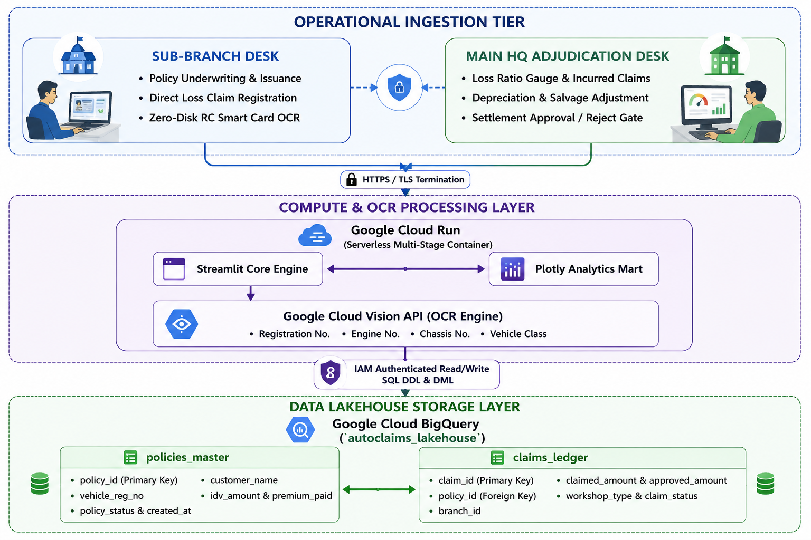
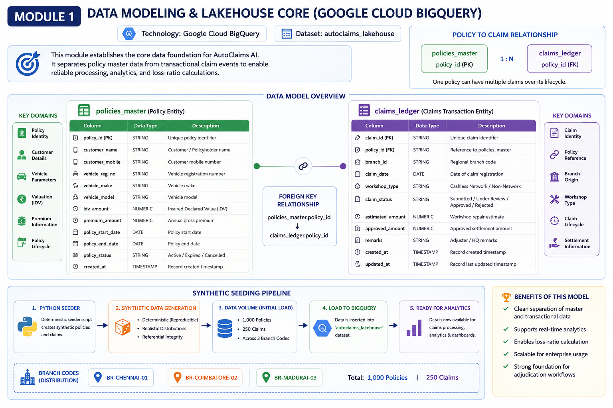
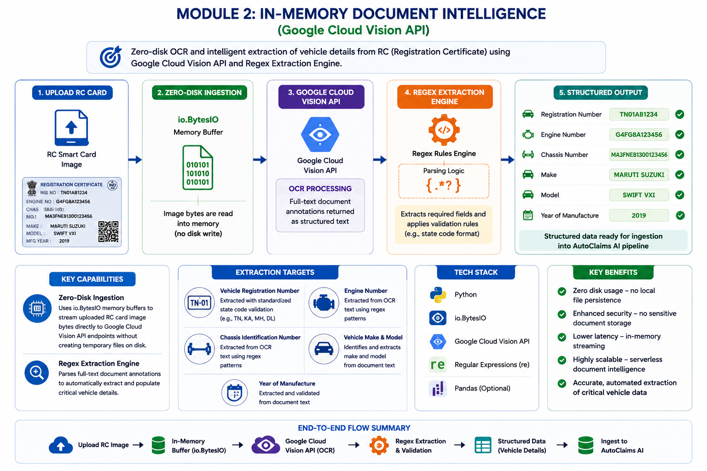
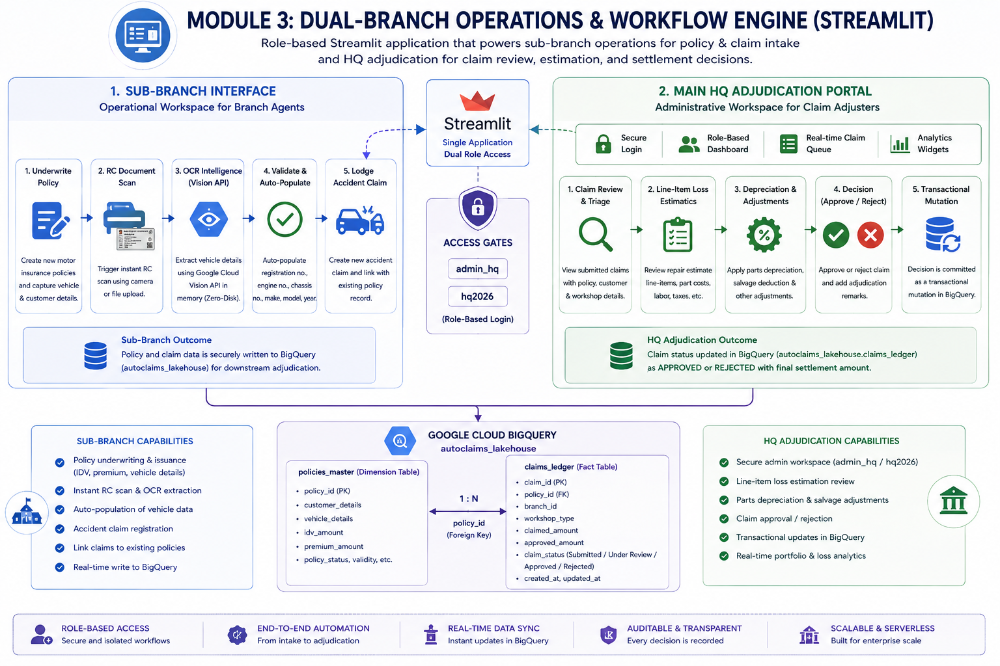
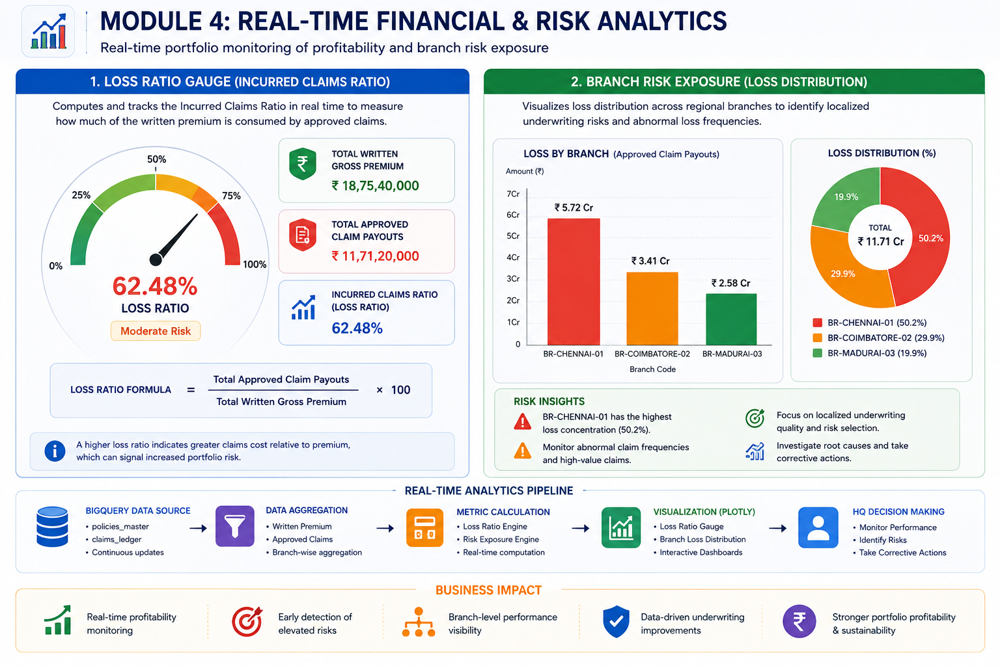
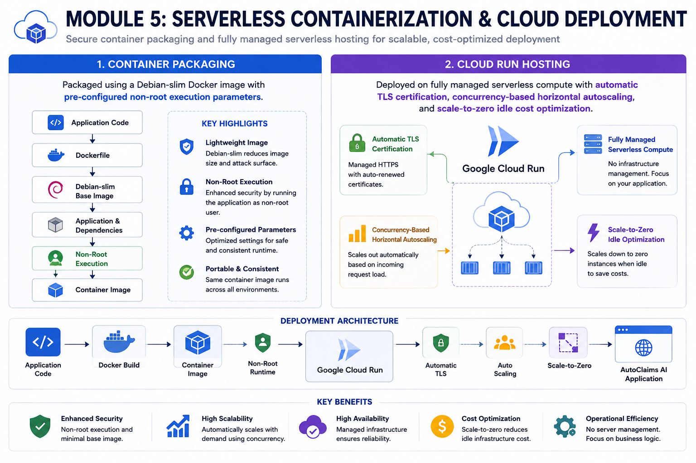

# 🚗 AutoClaims AI

> ### ☁️ Serverless Insurance Data Lakehouse & Ingestion Pipeline
>
> **“Transforming manual, fragmented motor insurance claims into an automated, zero-disk, intelligent data lakehouse ecosystem.”**

---

## 📌 Project Overview

**AutoClaims AI** is a **cloud-native insurance data lakehouse and adjudication platform** built on **Google Cloud Platform (GCP)**.

The platform automates the **end-to-end motor insurance claim lifecycle** — from capturing field-level documents at regional sub-branches to centralized data synchronization, analytics, and claim adjudication at corporate headquarters.

### 🔄 End-to-End Claim Lifecycle

```text
📄 Field Document Capture
        │
        ▼
🧠 In-Memory OCR Extraction
        │
        ▼
⚡ Automated Data Processing
        │
        ▼
☁️ Centralized BigQuery Lakehouse
        │
        ▼
📊 Loss Ratio Analytics
        │
        ▼
🏢 Corporate Adjudication
```

## 🎯 Key Objective

AutoClaims AI is designed to replace **manual, fragmented, and disk-dependent claim-processing workflows** with a:

* ☁️ **Cloud-native** architecture
* ⚡ **Automated** ingestion and processing pipeline
* 💾 **Zero-disk** document-processing approach
* 🧠 **Intelligent OCR-driven** data extraction
* 🏗️ **Centralized BigQuery lakehouse** architecture
* 📊 **Automated insurance analytics**
* 🔐 **Scalable and enterprise-ready** data platform

## 🏢 Business Flow

The platform connects **regional insurance sub-branches** with **corporate headquarters**, creating a unified data ecosystem for motor insurance claims.

```text
👨‍💼 Field / Sub-Branch
        │
        │ 📸 Claim Documents
        ▼
🧠 OCR & Data Extraction
        │
        │ ⚡ In-Memory Processing
        ▼
☁️ GCP Data Ingestion Layer
        │
        ▼
🏞️ BigQuery Data Lakehouse
        │
        ├── 📈 Loss Ratio Analytics
        ├── 🔍 Claim Analysis
        └── ⚖️ Automated Adjudication
        │
        ▼
🏢 Corporate Headquarters
```

### 💡 Core Vision

> **Capture once → Process in memory → Ingest automatically → Analyze centrally → Adjudicate intelligently.**

AutoClaims AI establishes a **single, automated data foundation** for motor insurance operations while reducing manual intervention, eliminating unnecessary disk-based processing, and enabling near-real-time analytical decision-making.


## 🏗️ Overall Architecture

<p align="center">
  
</p>


# 🎯 Business Problem & Solution Scope

## 🚧 The Operational Bottlenecks

Traditional motor insurance claim processing often involves **manual data entry, disconnected systems, and locally stored sensitive documents**. These limitations create operational delays, data-quality issues, and security risks.

### 📝 1. Manual Document Entry

Regional branch officers manually enter **Vehicle Registration Certificate (RC)** details into operational systems.

This introduces:

* ❌ **Transcription errors**
* ⏳ **Processing latency**
* 👤 **High dependency on manual intervention**
* 🔁 **Repetitive data-entry workflows**

---

### 🗂️ 2. Fragmented Data Silos

Policy transactions, claims information, and executive reporting frequently exist across **disconnected data sources**.

```text
🗄️ Policy Database
       │
       │ ❌ Disconnected
       ▼
📊 Claims Spreadsheets
       │
       │ ❌ Manual Reconciliation
       ▼
📈 Executive Reporting Mart
```

This fragmentation makes it difficult to establish a **single, consistent view of insurance operations** and increases the effort required for reconciliation and reporting.

---

### 🔐 3. Compliance & Security Vulnerabilities

Scanned **identity documents and vehicle RC documents** stored on local disks create additional security and compliance exposure.

Potential risks include:

* 💾 Persistent local file storage
* 🔓 Unauthorized access to sensitive documents
* 🗃️ Uncontrolled document copies
* ⚠️ Increased data-privacy compliance exposure

---

# ⚙️ Engineering Solution

AutoClaims AI addresses these operational challenges through a **serverless, zero-disk, cloud-native architecture**.

## 💨 1. Zero-Disk Document Extraction

Raw RC smart-card uploads are processed through **volatile RAM buffers** before being submitted to **Google Cloud Vision API** for OCR extraction.

```text
📄 RC Smart Card
      │
      ▼
⚡ RAM Buffer
      │
      ▼
🧠 Google Cloud Vision API
      │
      ▼
🔤 Extracted Structured Data
      │
      ▼
☁️ Cloud Data Layer
```

The workflow avoids persistent local file caching during document processing, supporting a **zero-disk ingestion model** for sensitive claim documents.

---

## ☁️ 2. Serverless Analytical Core

The centralized analytical foundation is built on **Google Cloud BigQuery**.

The platform uses a normalized dual-ledger model consisting of:

| Dataset / Table   | Primary Purpose                                |
| ----------------- | ---------------------------------------------- |
| `policies_master` | Centralized policy and vehicle information     |
| `claims_ledger`   | Centralized motor insurance claim transactions |

This provides a unified analytical foundation for **claim processing, reconciliation, reporting, and loss-ratio analysis**.

---

## 👥 3. Dual-Tier Role Routing

AutoClaims AI separates operational responsibilities into two distinct application workflows while maintaining a unified deployment architecture.

```text
                    ☁️ Cloud Run
                        │
             ┌──────────┴──────────┐
             │                     │
             ▼                     ▼
     🏢 Sub-Branch Desk      🏛️ Main HQ Console
             │                     │
             ▼                     ▼
    👨‍💼 Field Claim Officer    👨‍💼 Claims Adjuster
             │                     │
             ▼                     ▼
      📄 Claim Intake        ⚖️ Adjudication
```

### 🏢 Sub-Branch Desk

Designed for **field claim officers** to:

* 📸 Capture RC and claim documents
* 🧠 Extract information using OCR
* 📝 Initiate claim records
* ⚡ Submit structured claim data

### 🏛️ Main HQ Console

Designed for **claims adjusters** to:

* 🔍 Review centralized claims
* 📊 Analyze claim information
* ⚖️ Perform adjudication workflows
* 📈 Access centralized analytical insights

---

## 🏆 Engineering Outcome

The solution transforms a fragmented, manual workflow into a **centralized and automated insurance data platform**:

```text
Manual Entry       → 🧠 Automated OCR
Local Files        → ⚡ Zero-Disk Processing
Data Silos         → ☁️ Centralized BigQuery
Disconnected Roles → 👥 Dual-Tier Role Routing
Manual Analytics   → 📊 Automated Insights
```

> **AutoClaims AI converts operational complexity into a scalable, secure, and analytics-ready cloud architecture.**

# 🏗️ End-to-End System Architecture

> The **AutoClaims AI** platform is structured as a **three-tier, cloud-native data lakehouse architecture** designed to process motor insurance claims from regional branch ingestion through centralized enterprise analytics — while minimizing manual processing latency and eliminating persistent local document storage.

---

## 🔄 Architecture Overview

<p align="center">
  
</p>


---

# 1️⃣ Operational Ingestion Tier

### 🏪 Sub-Branch Operations

Field agents handle customer-facing insurance transactions at regional branches.

Key responsibilities include:

* 📝 **Motor Policy Underwriting & Issuance**
* 💰 **Insured Declared Value (IDV) Calculation**
* 🚗 **Motor Damage Claim Registration**
* 📄 **Vehicle RC Smart Card Upload**
* 🧠 **Zero-Disk OCR Processing Initiation**

The Sub-Branch Desk acts as the primary **operational entry point** for policy and claim information.

### 🏛️ Main HQ Operations

Headquarters claim adjusters operate through a secured adjudication workspace:

```text
`admin_hq`
```

The HQ workspace enables adjusters to:

* 🔍 Review itemized workshop repair estimates
* 📉 Apply depreciation adjustments
* ♻️ Apply salvage deductions
* 💰 Review settlement amounts
* ✅ Approve claim payouts
* ❌ Reject claims where applicable

### 🔐 Network & Security Boundary

All user interactions and application payloads pass through:

**HTTPS → TLS Termination → Cloud Application**

This provides encrypted communication while protecting sensitive policyholder and claim information **in transit**.

---

# 2️⃣ Compute & OCR Processing Layer

## ☁️ Google Cloud Run

The core application is packaged inside a **multi-stage Docker container** and deployed on **Google Cloud Run**.

Cloud Run provides:

* ⚡ Request-based autoscaling
* 📈 Automatic capacity management
* 💤 Scale-to-zero when idle
* 💰 Reduced idle infrastructure costs
* 🐳 Containerized application execution

```text
User Request
     │
     ▼
☁️ Cloud Run
     │
     ├── 🖥️ Streamlit Application
     ├── 📊 Plotly Analytics
     └── 🧠 OCR Processing
```

---

## 🖥️ Streamlit Core Engine

The **Streamlit Engine** provides the application interface for branch and headquarters users.

It manages:

* 🧭 Role-based navigation
* 📝 Policy forms
* 📄 Claim registration
* 📤 RC document uploads
* 👥 Branch/HQ workflows
* 🔄 Application state

---

## 📊 Plotly Analytics Mart

The integrated **Plotly Analytics Mart** provides real-time portfolio visualizations.

Example analytical metric:

> **📈 Incurred Loss Ratio**

These visualizations allow HQ users to monitor portfolio-level claim exposure and loss performance.

---

## 🧠 Zero-Disk OCR Pipeline

One of the key engineering features of AutoClaims AI is its **zero-disk document-processing architecture**.

RC smart-card documents are processed directly from **volatile memory** using:

```python
io.BytesIO
```

The document lifecycle is:

```text
📄 RC Smart Card
       │
       ▼
⚡ RAM Buffer
       │
       ▼
🧠 Google Cloud Vision API
       │
       ▼
🔤 Raw OCR Text
       │
       ▼
🔎 Regex Parsing
       │
       ├── 🚗 Registration Number
       ├── ⚙️ Engine Number
       ├── 🔩 Chassis Number
       └── 🚙 Vehicle Class
```

### 🛡️ Zero-Disk Principle

The uploaded RC document is **not intentionally persisted to local disk** during the OCR workflow.

Instead:

```text
Upload → RAM → Vision API → OCR Text → Structured Data
```

This minimizes persistent exposure of sensitive vehicle and identity documentation.

---

# 3️⃣ Data Lakehouse Storage Layer

## ☁️ Google Cloud BigQuery

The centralized analytical core is built on **Google Cloud BigQuery**.

The project uses the:

```text
autoclaims_lakehouse
```

dataset as the centralized storage and analytical foundation.

---

## 🔐 IAM-Authenticated Data Access

The compute layer communicates with BigQuery through **IAM-authenticated service accounts**.

```text
☁️ Cloud Run
      │
      │ 🔐 IAM Authentication
      ▼
☁️ BigQuery
      │
      ├── SQL DDL
      └── SQL DML
```

This architecture avoids embedding traditional database passwords or hardcoded credentials inside the application.

---

## 📋 `policies_master` Entity

`policies_master` functions as the primary **policy dimension table**.

It tracks:

| Attribute             | Purpose                                   |
| --------------------- | ----------------------------------------- |
| `policy_id`           | Unique policy identifier                  |
| Customer details      | Policyholder information                  |
| Vehicle parameters    | Vehicle identification and classification |
| IDV valuation         | Insured Declared Value                    |
| Gross Written Premium | Premium information                       |
| Policy lifecycle      | Policy status and timestamps              |

---

## 📑 `claims_ledger` Entity

`claims_ledger` functions as the central **transactional claim fact table**.

It captures:

| Attribute               | Purpose                          |
| ----------------------- | -------------------------------- |
| `claim_id`              | Unique claim identifier          |
| `policy_id`             | Associated policy reference      |
| `branch_id`             | Regional claim origin            |
| Workshop classification | Cashless Network / Reimbursement |
| Repair estimate         | Estimated repair cost            |
| Approved settlement     | Final approved payout            |

---

## 🔗 Relational Lakehouse Synchronization

The two core entities are logically connected through:

```text
policies_master
       │
       │ policy_id
       │
       ▼
claims_ledger
```

This relationship enables centralized:

* 🔍 **Claim history lookups**
* 📊 **Loss ratio aggregation**
* 💰 **Settlement analysis**
* 📈 **Portfolio analytics**
* ⚖️ **Adjudication workflows**

---

# 🚀 End-to-End Data Journey

The complete AutoClaims AI workflow can be summarized as:

```text
📄 Customer / Vehicle Document
              │
              ▼
🏪 Sub-Branch Desk
              │
              ▼
🔐 HTTPS / TLS
              │
              ▼
☁️ Google Cloud Run
              │
       ┌──────┴──────┐
       ▼             ▼
🖥️ Streamlit     📊 Plotly
       │
       ▼
⚡ RAM / io.BytesIO
       │
       ▼
🧠 Google Cloud Vision
       │
       ▼
🔎 Regex Extraction
       │
       ▼
🔐 IAM Authentication
       │
       ▼
☁️ Google BigQuery
       │
       ├── 📋 policies_master
       │
       └── 📑 claims_ledger
              │
              ▼
📈 Loss Ratio Analytics
              │
              ▼
🏛️ Main HQ Adjudication
              │
              ▼
✅ Approve / ❌ Reject
```

> ### 💡 Architecture Principle
> **Capture → Process in Memory → Extract → Ingest → Analyze → Adjudicate**
>
> AutoClaims AI brings these stages together into a **serverless, zero-disk, cloud-native insurance data lakehouse ecosystem**.

## 🔬 Module-by-Module Technical Deep Dive

### 1️⃣ Module 1: Data Modeling & Lakehouse Core

> **Technology:** ☁️ Google Cloud BigQuery
> **Dataset:** `autoclaims_lakehouse`

The **Data Modeling & Lakehouse Core** serves as the centralized data foundation of AutoClaims AI. It separates relatively stable policy information from transactional claim events, enabling reliable claim processing, analytics, and loss-ratio calculations.

---

### 📋 `policies_master` — Policy Entity

The **`policies_master`** table acts as the primary policy entity within the lakehouse.

It stores:

* 🆔 `policy_id`
* 👤 Customer demographics
* 🚗 Vehicle parameters
* 💰 Insured Declared Value (IDV)
* 💵 Annual gross premium
* 📅 Policy validity and lifecycle status

---

### 📑 `claims_ledger` — Claims Transaction Entity

The **`claims_ledger`** acts as the central transactional entity for motor insurance claims.

It tracks the complete claim lifecycle:

```text
📝 Submitted
      │
      ▼
🔍 Under Review
      │
      ├───────────────┐
      ▼               ▼
  ✅ Approved       ❌ Rejected
      │
      ▼
💰 Settlement
```

It captures:

* 🆔 `claim_id`
* 🔗 `policy_id`
* 📍 Regional branch origin
* 🏭 Workshop classification
* 🔧 Itemized repair estimates
* 💰 Approved settlement amount
* 📊 Claim status

---

### 🔗 Policy-to-Claim Relationship

The two core entities are connected through `policy_id`:

```text
policies_master.policy_id
          │
          │ 1 : N
          ▼
claims_ledger.policy_id
```

This relationship enables:

* 🔍 Policy-level claim history
* 📊 Loss-ratio calculations
* 💰 Premium vs. claim-cost analysis
* 📍 Branch-level analytics
* ⚖️ Centralized adjudication

---

### 🌱 Synthetic Seeding Pipeline

A **deterministic Python seeder** was developed to populate the BigQuery lakehouse with a consistent baseline dataset for development, testing, and demonstration.

| Entity      | Initial Records |
| ----------- | --------------: |
| 📋 Policies |       **1,000** |
| 📑 Claims   |         **250** |

The records are distributed across three regional branch codes:

```text
📍 BR-CHENNAI-01
📍 BR-COIMBATORE-02
📍 BR-MADURAI-03
```

### ⚙️ Seeding Flow

```text
🐍 Python Seeder
       │
       ▼
🎲 Deterministic Synthetic Data
       │
       ├───────────────┐
       ▼               ▼
📋 1,000 Policies   📑 250 Claims
       │               │
       └───────┬───────┘
               ▼
        ☁️ BigQuery
               │
               ▼
    `autoclaims_lakehouse`
```

### 🎯 Why Deterministic Seeding?

Deterministic data generation provides a **reproducible development environment**, making it easier to:

* 🧪 Perform repeatable testing
* 🔄 Rebuild the baseline dataset
* 📊 Validate analytical queries
* 🐛 Reproduce and debug issues
* 🚀 Demonstrate the platform consistently

**Module 1 establishes the centralized data foundation on which the remaining AutoClaims AI modules operate.**

<p align="center">
  
</p>

### 2️⃣ Module 2: In-Memory Document Intelligence

> **Technology:** 🧠 Google Cloud Vision API
> **Core Principle:** ⚡ Zero-Disk Document Processing

This module provides **zero-disk document intelligence** for vehicle Registration Certificate (RC) processing. Uploaded RC card images are read directly from memory, processed through the **Google Cloud Vision API**, and converted into structured vehicle information using a **Regex Extraction Engine**.

---

## ⚡ 1. Zero-Disk Ingestion

The application uses Python's `io.BytesIO` memory buffer to hold uploaded RC image bytes temporarily in **volatile memory**.

The image is streamed directly to the Google Cloud Vision API without creating temporary files on the local filesystem.

```text
📄 RC Card Image
       │
       ▼
⚡ `io.BytesIO`
       │
       │ In-Memory Bytes
       ▼
🧠 Google Cloud Vision API
       │
       ▼
🔤 OCR Text
```

### 🛡️ Key Advantage

```text
Upload → RAM → OCR → Structured Data
```

No temporary document file is intentionally created or persisted on disk during the ingestion workflow.

---

## 🔎 2. Regex Extraction Engine

The complete text returned by the Vision API is passed through a **regular-expression-based parsing layer**.

The extraction engine identifies and validates key vehicle attributes automatically.

### 🚗 Extracted Information

| Field                            | Processing                                        |
| -------------------------------- | ------------------------------------------------- |
| 🚘 Vehicle Registration Number   | Extracted with standardized state-code validation |
| ⚙️ Engine Number                 | Extracted from OCR text                           |
| 🔩 Chassis Identification Number | Extracted from OCR text                           |
| 🏭 Vehicle Make                  | Automatically identified                          |
| 🚙 Vehicle Model                 | Automatically identified                          |
| 📅 Year of Manufacture           | Extracted from document text                      |

---

## 🔄 Document Intelligence Pipeline

```text
📄 RC Smart Card
       │
       ▼
⚡ In-Memory Buffer
   `io.BytesIO`
       │
       ▼
☁️ Google Cloud Vision API
       │
       ▼
🔤 Full-Text OCR Annotation
       │
       ▼
🔎 Regex Extraction Engine
       │
       ▼
✅ Validation & Standardization
       │
       ▼
📋 Structured Vehicle Data
       │
       ▼
☁️ AutoClaims AI Data Pipeline
```

---

## 🏆 Why This Module Matters

The in-memory OCR architecture provides several engineering advantages:

* 💾 **Zero persistent document storage**
* ⚡ **Reduced disk I/O and processing latency**
* 🔐 **Lower exposure of sensitive vehicle documents**
* 📈 **Serverless scalability**
* 🤖 **Automated vehicle-data extraction**
* ✅ **Standardized and validated output**

> **Core Principle:**
> **Capture → Process in Memory → OCR → Parse → Validate → Ingest**

<p align="center">
  
</p>


### 3️⃣ Module 3: Dual-Branch Operations & Workflow Engine

> **Technology:** 🖥️ Streamlit
> **Role:** 👥 Unified operational and adjudication workflow engine

The **Dual-Branch Operations & Workflow Engine** provides role-specific interfaces for regional sub-branch agents and headquarters claim adjusters within the AutoClaims AI platform.

---

## 🏪 1. Sub-Branch Interface

The **Sub-Branch Interface** serves as the operational workspace for field and branch agents.

Agents can:

* 📝 **Underwrite and issue motor insurance policies**
* 📄 **Trigger instant RC document scanning**
* 🧠 **Extract vehicle information through OCR**
* 🚗 **Register new accident claims**
* 🔗 **Associate claims with existing policy records**

### 🔄 Sub-Branch Workflow

```text
👨‍💼 Branch Agent
       │
       ▼
📝 Policy Underwriting
       │
       ▼
📄 RC Document Scan
       │
       ▼
🧠 OCR Extraction
       │
       ▼
🔎 Vehicle Data Validation
       │
       ▼
🚗 Accident Claim Registration
       │
       ▼
☁️ BigQuery
```

---

## 🏛️ 2. Main HQ Adjudication Portal

The **Main HQ Adjudication Portal** provides a secured administrative workspace for claims adjusters.

Access is controlled through application-level access gates:

```text
🔐 `admin_hq`
🔑 `hq2026`
```

Once authenticated, HQ users can review and process submitted claims.

### ⚖️ Adjudication Capabilities

#### 🔧 Line-Item Loss Estimatics

Adjusters can evaluate individual repair components and apply appropriate depreciation adjustments.

```text
🛠️ Repair Estimate
        │
        ▼
📋 Line-Item Review
        │
        ▼
📉 Parts Depreciation
        │
        ▼
💰 Adjusted Settlement
```

#### ✅ Claim Approval / ❌ Rejection

The portal performs transactional mutations against BigQuery to update the claim decision.

```text
📑 Claim Under Review
        │
        ▼
⚖️ HQ Adjudication
        │
   ┌────┴────┐
   ▼         ▼
✅ APPROVE  ❌ REJECT
   │         │
   └────┬────┘
        ▼
☁️ BigQuery
`claims_ledger`
```

---

## 🔗 Unified Dual-Role Architecture

Both workflows operate through the same Streamlit application while exposing different capabilities based on the operational role.

```text
                 🖥️ Streamlit Application
                          │
              ┌───────────┴───────────┐
              │                       │
              ▼                       ▼
       🏪 Sub-Branch              🏛️ Main HQ
       Operations                 Adjudication
              │                       │
              ▼                       ▼
       📄 Policy & Claim        ⚖️ Claim Review
       🧠 OCR Processing        📉 Depreciation
       🚗 Claim Registration    ✅ Approve / ❌ Reject
              │                       │
              └───────────┬───────────┘
                          ▼
                   ☁️ BigQuery
```

> **Module 3 establishes the operational control layer that connects branch-level claim intake with centralized headquarters adjudication.**

<p align="center">
  
</p>
### 4️⃣ Module 4: Real-Time Financial & Risk Analytics

> **Focus:** 📊 Real-Time Insurance Portfolio Monitoring
> **Primary Metrics:** 💰 Incurred Loss Ratio & 📍 Branch Risk Exposure

The **Real-Time Financial & Risk Analytics** module provides centralized visibility into insurance portfolio performance. It enables headquarters users to monitor claim payouts against written premiums and identify branches with elevated loss exposure.

---

## 📈 1. Loss Ratio Gauge

The platform computes the **Incurred Claims Ratio (Loss Ratio)** in real time by comparing total approved claim payouts against total written gross premium.

### 🧮 Formula

$$
\text{Loss Ratio} =
\left(
\frac{\text{Total Approved Claim Payouts}}
{\text{Total Written Gross Premium}}
\right)
\times 100
$$

### 💡 Interpretation

The loss ratio indicates how much of the written premium is being consumed by approved claim payouts.

```text
💵 Total Written Gross Premium
              │
              ▼
       📊 Portfolio Base
              │
              │ compared with
              ▼
💰 Total Approved Claim Payouts
              │
              ▼
        📈 Loss Ratio %
```

A higher loss ratio indicates **greater claims cost relative to premium**, which can signal increased portfolio risk.

---

## 📍 2. Branch Risk Exposure

The module provides branch-level visualization of claim losses across regional operations.

```text
🏢 Regional Branches
        │
        ├── 📍 Chennai
        ├── 📍 Coimbatore
        └── 📍 Madurai
                │
                ▼
        📊 Loss Distribution
                │
                ▼
        🔎 Risk Identification
```

Branch-level analytics help identify:

* 🚨 **Localized underwriting risks**
* 📈 **Abnormal claim frequencies**
* 💰 **High-loss branches**
* 📊 **Uneven loss distribution**
* 🔍 **Potential portfolio anomalies**

---

## 🔄 Real-Time Analytics Flow

```text
☁️ BigQuery
    │
    ├── 📋 Written Premium
    │
    └── 📑 Approved Claims
             │
             ▼
      🧮 Loss Ratio Engine
             │
       ┌─────┴─────┐
       ▼           ▼
   📈 Overall    📍 Branch
   Loss Ratio    Exposure
       │           │
       └─────┬─────┘
             ▼
      📊 Plotly Dashboard
             │
             ▼
       🏛️ HQ Decision Making
```

> **Module 4 transforms raw policy and claim transactions into real-time financial intelligence, allowing HQ teams to monitor portfolio health and identify emerging regional risks.**

<p align="center">
  
</p>


# ☁️ Module 5: Serverless Containerization & Cloud Deployment

> **Technologies:** 🐳 Docker • ☁️ Google Cloud Run  
> **Focus:** 🔐 Secure Containerization • 📈 Serverless Scalability • 💰 Cost Optimization

The **Serverless Containerization & Cloud Deployment** module packages the AutoClaims AI application into a lightweight Docker container and deploys it on **Google Cloud Run** as a fully managed serverless workload.

---

## 🐳 1. Container Packaging

The application is packaged using a **Debian-slim Docker image**, providing a lightweight runtime environment for the application and its dependencies.

The container is configured with **non-root execution parameters**, reducing unnecessary privileges during application execution.

### 🔄 Container Build Flow

```text
👨‍💻 Application Source Code
          │
          ▼
🐳 Dockerfile
          │
          ▼
🐧 Debian-Slim Base Image
          │
          ▼
📦 Application + Dependencies
          │
          ▼
🔐 Non-Root Execution
          │
          ▼
📦 Container Image
```

### 🔐 Security Benefits

- 🛡️ **Reduced Container Privileges**  
  The application does not require unnecessary root-level privileges.

- 🔒 **Non-Root Application Execution**  
  The container is configured to run the application using a non-root execution context.

- 📦 **Lightweight Base Image**  
  Debian-slim reduces unnecessary operating-system components and keeps the container lightweight.

- 🧩 **Isolated Application Runtime**  
  Application dependencies are packaged within the container, providing a consistent runtime environment.

- ⚙️ **Consistent Deployment Environment**  
  The same container image can be used across deployment environments.

---

## ☁️ 2. Cloud Run Hosting

The containerized application is deployed on **Google Cloud Run**, a fully managed serverless compute platform.

Cloud Run manages the underlying infrastructure and automatically adjusts the number of running container instances according to incoming application traffic.

### ⚡ Cloud Run Capabilities

| Capability | Description |
|---|---|
| 🔐 **Automatic TLS** | Provides managed TLS certification for secure HTTPS traffic |
| 📈 **Horizontal Autoscaling** | Automatically adjusts container instances based on request load and configured concurrency |
| 💤 **Scale-to-Zero** | Allows the service to scale down to zero instances when idle |
| ☁️ **Fully Managed Compute** | Eliminates the need for traditional server provisioning and infrastructure management |
| 🐳 **Container Native** | Runs the packaged Docker application directly |

---

## 🔄 Deployment Architecture

```text
👨‍💻 Application Code
        │
        ▼
🐳 Docker Build
        │
        ▼
📦 Debian-Slim Container
        │
        ▼
🔐 Non-Root Runtime
        │
        ▼
☁️ Google Cloud Run
        │
        ├── 🔒 Automatic TLS
        │
        ├── 📈 Concurrency-Based Autoscaling
        │
        └── 💤 Scale-to-Zero
        │
        ▼
🚀 AutoClaims AI
```

---

## 📈 3. Concurrency-Based Horizontal Autoscaling

Cloud Run can dynamically adjust the number of container instances according to incoming request traffic and configured concurrency.

When application demand increases, additional container instances can be started. When demand decreases, unnecessary instances can be removed.

```text
             📥 Incoming Requests
                     │
                     ▼
              ☁️ Google Cloud Run
                     │
          ┌──────────┴──────────┐
          │                     │
          ▼                     ▼
     📉 Low Traffic        📈 High Traffic
          │                     │
          ▼                     ▼
   Fewer Instances       More Instances
          │                     │
          └──────────┬──────────┘
                     ▼
              🖥️ Application
```

### 🎯 Engineering Benefit

- 📈 Handles increasing application traffic automatically.
- 🔄 Removes the need for manual server provisioning.
- ⚡ Adapts compute capacity to workload demand.
- 🏗️ Supports scalable application execution.

---

## 💰 4. Scale-to-Zero Idle Cost Optimization

Cloud Run can scale the application down to **zero running instances** when there is no active workload.

This is particularly useful for applications that experience periods of low or no traffic.

```text
📈 Active Traffic
      │
      ▼
🖥️ Running Container Instances
      │
      │ No Active Traffic
      ▼
💤 Zero Running Instances
```

### 💡 Cost Optimization Principle

```text
Active Workload
      ↓
Compute Resources
      ↓
Application Processing

No Workload
      ↓
Scale to Zero
      ↓
Reduced Idle Compute Consumption
```

---

## 🔐 5. Secure Deployment Flow

The production request path can be represented as:

```text
🌐 User Request
      │
      ▼
🔒 HTTPS / TLS
      │
      ▼
☁️ Google Cloud Run
      │
      ▼
🐳 Non-Root Container
      │
      ▼
🖥️ AutoClaims AI
```

### 🛡️ Security Characteristics

- 🔒 **Encrypted HTTPS/TLS communication**
- 🔐 **Non-root container execution**
- 🧩 **Isolated container runtime**
- ☁️ **Managed cloud infrastructure**
- 🚫 **Reduced dependency on manually managed servers**

---

## 🏗️ 6. AutoClaims AI Deployment Architecture

The deployment layer integrates the containerized application with the other AutoClaims AI services.

```text
                    🌐 Users
                       │
                       ▼
                  🔒 HTTPS / TLS
                       │
                       ▼
              ☁️ Google Cloud Run
                       │
                🐳 Docker Container
                       │
          ┌────────────┼────────────┐
          │            │            │
          ▼            ▼            ▼
     🖥️ Streamlit   🧠 Vision API  📊 Plotly
          │
          │
          ▼
   🔐 IAM Authentication
          │
          ▼
     ☁️ Google BigQuery
```

---

## 🏆 7. Key Engineering Benefits

| Benefit | Engineering Value |
|---|---|
| 🐳 **Containerization** | Packages application code and dependencies into a reproducible runtime |
| 🔐 **Non-Root Execution** | Reduces unnecessary container privileges |
| ☁️ **Serverless Deployment** | Removes the need to manage traditional servers |
| 📈 **Automatic Scaling** | Dynamically adapts compute capacity to workload |
| 🔒 **Automatic TLS** | Provides secure HTTPS communication |
| 💤 **Scale-to-Zero** | Reduces idle compute consumption |
| ⚡ **Operational Efficiency** | Infrastructure automatically responds to changing traffic |

---

## 🔑 8. Key Terms

| Term | Meaning |
|---|---|
| **Docker** | Platform used to package applications into containers |
| **Debian-Slim** | Lightweight Debian-based container image |
| **Container Image** | Packaged application environment containing code and dependencies |
| **Non-Root Execution** | Running an application without root-level privileges |
| **Cloud Run** | Fully managed serverless container execution platform |
| **Concurrency** | Number of requests that can be handled by a container instance |
| **Horizontal Autoscaling** | Increasing or decreasing the number of container instances based on workload |
| **Scale-to-Zero** | Scaling running instances down to zero during periods without active workload |
| **TLS** | Protocol used to encrypt network communication |
| **Serverless** | Cloud execution model where infrastructure management is handled by the cloud provider |

---

## 📦 9. Revision Box

```text
🐳 Docker
     ↓
🐧 Debian-Slim Image
     ↓
🔐 Non-Root Execution
     ↓
📦 Container Image
     ↓
☁️ Google Cloud Run
     ↓
🔒 Automatic TLS
     ↓
📈 Concurrency-Based Autoscaling
     ↓
💤 Scale-to-Zero
     ↓
🚀 AutoClaims AI
```

---

## 📝 10. Summary

The **Serverless Containerization & Cloud Deployment** module provides AutoClaims AI with a **secure, lightweight, scalable, and cost-efficient production runtime**.

The complete deployment lifecycle can be summarized as:

> **Containerize → Secure → Deploy → Automatically Scale → Scale to Zero**

This architecture allows AutoClaims AI to run as a **cloud-native serverless application** without requiring traditional server provisioning or manual infrastructure scaling.


<p align="center">
  
</p>

## 🧰 Technology Stack

The **AutoClaims AI** platform is built using a cloud-native technology stack designed to support scalable data processing, intelligent document extraction, real-time analytics, secure application execution, and version-controlled deployment.

---

### 🏗️ Technology Stack Overview

| Layer | Component | Enterprise Purpose |
|---|---|---|
| 🗄️ **Data Lakehouse** | **Google Cloud BigQuery** | Columnar analytical warehouse and transactional claims ledger |
| 🧠 **Machine Vision** | **Google Cloud Vision API** | Document text annotation and OCR parameter extraction |
| 🖥️ **Web Runtime** | **Streamlit & Plotly Express** | Branch routing, claims UI, and financial dashboards |
| 🐳 **Containerization** | **Docker** | Immutable application runtime packaging |
| ☁️ **Cloud Compute** | **Google Cloud Run** | Serverless, auto-scaling managed container hosting |
| 🔐 **Access & Security** | **Google Cloud IAM** | Role-based service-account credential management |
| 🔄 **Source Control** | **Git & GitHub** | Version management and deployment tracking |

---

## 🗄️ 1. Data Lakehouse — Google Cloud BigQuery

**Google Cloud BigQuery** acts as the centralized data and analytics layer for AutoClaims AI.

### Enterprise Purpose

- 📊 Columnar analytical data processing
- 📋 Centralized policy storage
- 📑 Transactional claims ledger
- 🔎 Real-time analytical querying
- 📈 Loss-ratio and risk analytics

**Core Dataset:**

```text
autoclaims_lakehouse
```

**Primary Entities:**

```text
📋 policies_master
        │
        │ policy_id
        ▼
📑 claims_ledger
```

---

## 🧠 2. Machine Vision — Google Cloud Vision API

**Google Cloud Vision API** provides the OCR capability for automated RC document processing.

### Enterprise Purpose

- 📄 Document text annotation
- 🔤 OCR extraction
- 🚗 Vehicle registration extraction
- ⚙️ Engine number extraction
- 🔩 Chassis number extraction
- 🚙 Vehicle attribute identification

The OCR pipeline processes RC documents through an **in-memory workflow** using `io.BytesIO`.

```text
📄 RC Document
      │
      ▼
⚡ In-Memory Buffer
      │
      ▼
🧠 Google Cloud Vision API
      │
      ▼
🔤 OCR Text
      │
      ▼
🔎 Structured Vehicle Data
```

---

## 🖥️ 3. Web Runtime — Streamlit & Plotly Express

**Streamlit** provides the application interface for branch operations and HQ workflows, while **Plotly Express** provides interactive financial and risk visualizations.

### Enterprise Purpose

- 🏪 Branch workflow routing
- 📝 Policy and claim interfaces
- 🧠 OCR workflow integration
- 🏛️ HQ adjudication workspace
- 📊 Financial dashboards
- 📈 Loss-ratio visualization
- 📍 Branch risk analysis

```text
👥 Users
   │
   ▼
🖥️ Streamlit
   │
   ├── 🏪 Sub-Branch Operations
   │
   └── 🏛️ HQ Adjudication
             │
             ▼
       📊 Plotly Express
             │
             ▼
       📈 Analytics Dashboard
```

---

## 🐳 4. Containerization — Docker

**Docker** packages the AutoClaims AI application and its dependencies into an immutable container runtime.

### Enterprise Purpose

- 📦 Application packaging
- 🔄 Reproducible deployments
- 🧩 Dependency isolation
- 🔐 Controlled runtime environment
- 🚀 Portable application execution

```text
👨‍💻 Application Code
        │
        ▼
🐳 Dockerfile
        │
        ▼
📦 Container Image
        │
        ▼
☁️ Cloud Run
```

---

## ☁️ 5. Cloud Compute — Google Cloud Run

**Google Cloud Run** provides the serverless compute environment for the containerized application.

### Enterprise Purpose

- ☁️ Fully managed container hosting
- 📈 Automatic horizontal autoscaling
- 🔐 Managed HTTPS/TLS
- 💤 Scale-to-zero capability
- 💰 Idle compute cost optimization

```text
📦 Docker Container
        │
        ▼
☁️ Google Cloud Run
        │
   ┌────┴────┐
   ▼         ▼
📈 Auto    💤 Scale
Scaling    to Zero
```

---

## 🔐 6. Access & Security — Google Cloud IAM

**Google Cloud IAM (Identity and Access Management)** provides identity and access control for cloud resources and service-to-service authentication.

### Enterprise Purpose

- 🔐 Service-account authentication
- 👥 Role-based access control
- 🛡️ Least-privilege permissions
- ☁️ Secure Cloud Run → BigQuery access
- 🚫 Avoidance of hardcoded cloud credentials

```text
☁️ Cloud Run
      │
      ▼
🔐 Google Cloud IAM
      │
      ▼
☁️ BigQuery
```

---

## 🔄 7. Source Control — Git & GitHub

**Git and GitHub** provide source-code version management and deployment tracking throughout the project lifecycle.

### Enterprise Purpose

- 📝 Version control
- 🔄 Change tracking
- 🌿 Branch management
- 🕐 Commit history
- 🚀 Deployment traceability
- 📚 Project documentation

```text
👨‍💻 Developer
      │
      ▼
🔄 Git
      │
      ▼
🐙 GitHub
      │
      ▼
📦 Versioned Source Code
```

---

## 🔗 Complete Technology Integration

The major technologies work together as a unified cloud-native architecture:

```text
                    👥 Users
                       │
                       ▼
              🖥️ Streamlit + Plotly
                       │
                       ▼
                 ☁️ Cloud Run
                       │
          ┌────────────┼────────────┐
          │            │            │
          ▼            ▼            ▼
       🧠 Vision     🔐 IAM      📊 Analytics
          │            │
          │            ▼
          │       ☁️ BigQuery
          │            │
          └────────────┤
                       ▼
              🗄️ AutoClaims Lakehouse
                       │
                ┌──────┴──────┐
                ▼             ▼
        📋 policies_master  📑 claims_ledger
```

---

## 🏆 Technology Stack Summary

| Technology | Primary Role |
|---|---|
| ☁️ **Google Cloud BigQuery** | Data lakehouse and analytical storage |
| 🧠 **Google Cloud Vision API** | OCR and document intelligence |
| 🖥️ **Streamlit** | Application and workflow interface |
| 📊 **Plotly Express** | Financial and risk visualization |
| 🐳 **Docker** | Containerization and runtime packaging |
| ☁️ **Google Cloud Run** | Serverless application hosting |
| 🔐 **Google Cloud IAM** | Identity and access management |
| 🔄 **Git & GitHub** | Version control and deployment tracking |

> **Technology Philosophy:**  
> **Build → Containerize → Secure → Deploy → Ingest → Analyze → Govern**


## 🌐 Live Application Demo

🔗 **Live Deployment:** [https://autoclaims-app-951447653027.us-central1.run.app/](https://autoclaims-app-951447653027.us-central1.run.app/)

> **HQ Adjudication Access Credentials:**
> * **Username:** `admin_hq`
> * **Password:** `hq2026`
