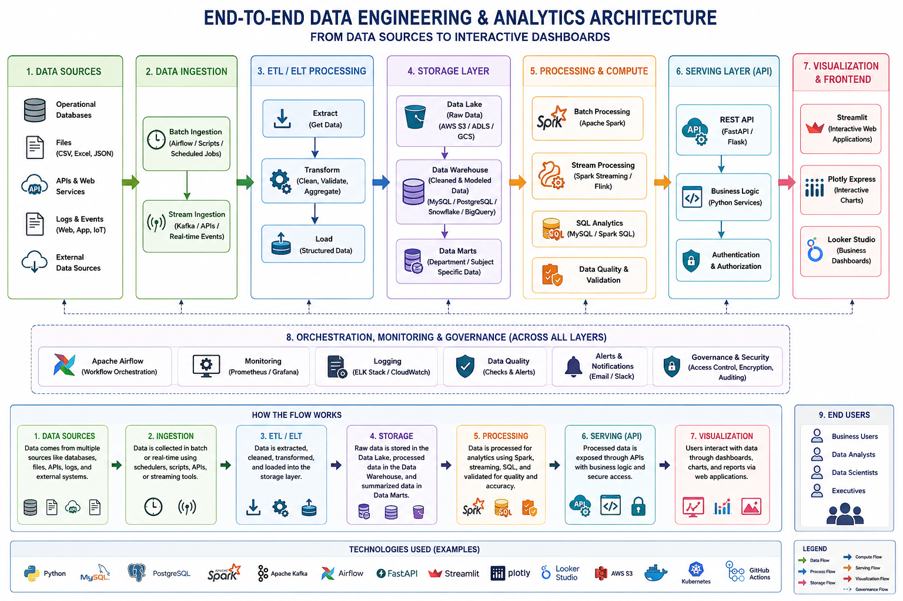

# 🚗 AutoClaims AI

> ### ☁️ Serverless Insurance Data Lakehouse & Ingestion Pipeline
>
> **“Transforming manual, fragmented motor insurance claims into an automated, zero-disk, intelligent data lakehouse ecosystem.”**

---

## 📌 Project Overview

**AutoClaims AI** is a **cloud-native insurance data lakehouse and adjudication platform** built on **Google Cloud Platform (GCP)**.

The platform automates the **end-to-end motor insurance claim lifecycle** — from capturing field-level documents at regional sub-branches to centralized data synchronization, analytics, and claim adjudication at corporate headquarters.

### 🔄 End-to-End Claim Lifecycle

```text
📄 Field Document Capture
        │
        ▼
🧠 In-Memory OCR Extraction
        │
        ▼
⚡ Automated Data Processing
        │
        ▼
☁️ Centralized BigQuery Lakehouse
        │
        ▼
📊 Loss Ratio Analytics
        │
        ▼
🏢 Corporate Adjudication
```

## 🎯 Key Objective

AutoClaims AI is designed to replace **manual, fragmented, and disk-dependent claim-processing workflows** with a:

* ☁️ **Cloud-native** architecture
* ⚡ **Automated** ingestion and processing pipeline
* 💾 **Zero-disk** document-processing approach
* 🧠 **Intelligent OCR-driven** data extraction
* 🏗️ **Centralized BigQuery lakehouse** architecture
* 📊 **Automated insurance analytics**
* 🔐 **Scalable and enterprise-ready** data platform

## 🏢 Business Flow

The platform connects **regional insurance sub-branches** with **corporate headquarters**, creating a unified data ecosystem for motor insurance claims.

```text
👨‍💼 Field / Sub-Branch
        │
        │ 📸 Claim Documents
        ▼
🧠 OCR & Data Extraction
        │
        │ ⚡ In-Memory Processing
        ▼
☁️ GCP Data Ingestion Layer
        │
        ▼
🏞️ BigQuery Data Lakehouse
        │
        ├── 📈 Loss Ratio Analytics
        ├── 🔍 Claim Analysis
        └── ⚖️ Automated Adjudication
        │
        ▼
🏢 Corporate Headquarters
```

### 💡 Core Vision

> **Capture once → Process in memory → Ingest automatically → Analyze centrally → Adjudicate intelligently.**

AutoClaims AI establishes a **single, automated data foundation** for motor insurance operations while reducing manual intervention, eliminating unnecessary disk-based processing, and enabling near-real-time analytical decision-making.


## 🏗️ Overall Architecture

<p align="center">
  
</p>
